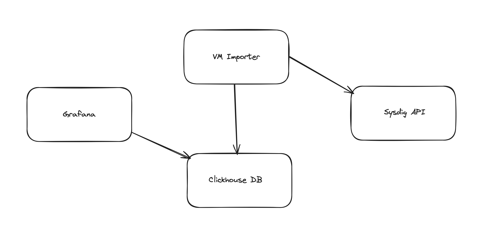
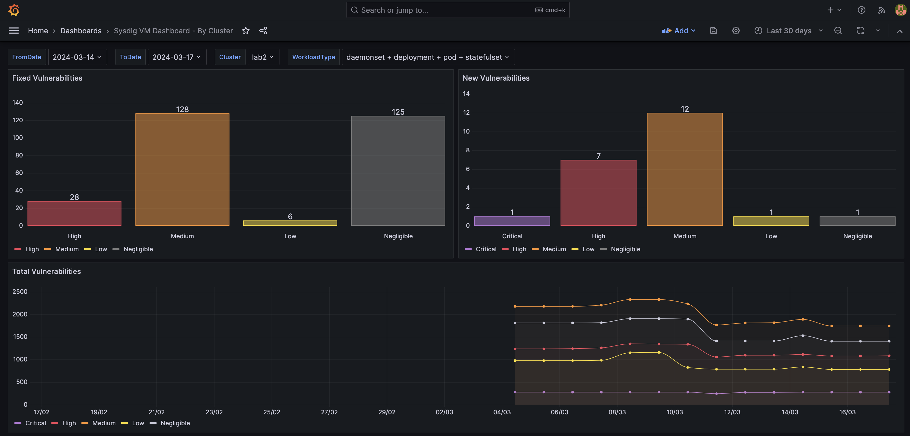
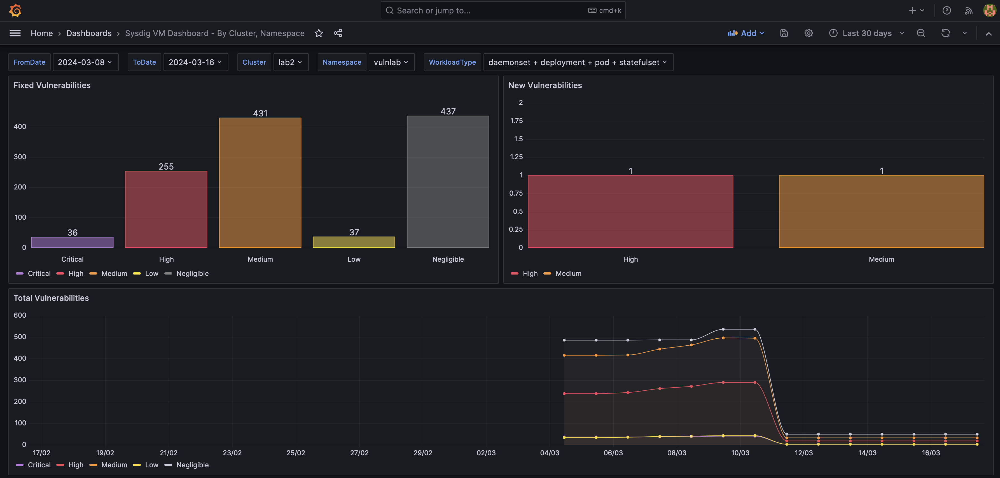
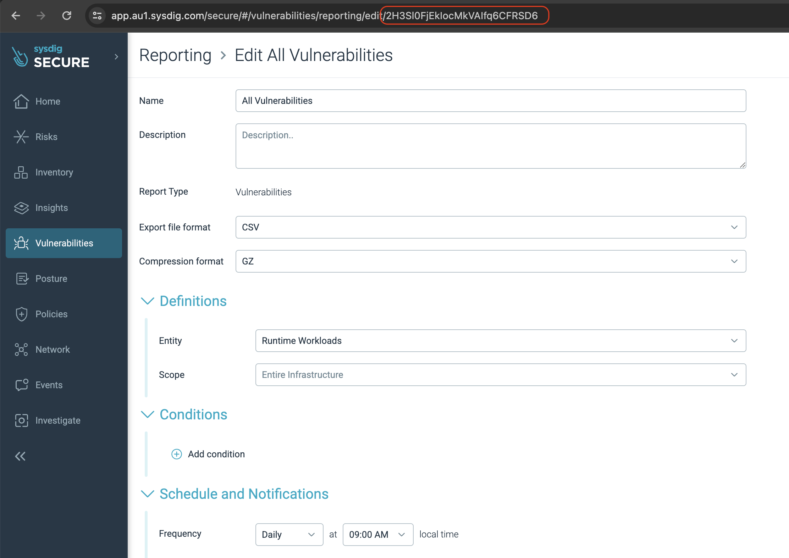

# Sysdig Vulnerability Dashboard Example

This repository contains an example of how you can build your own vulnerability reporting dashboards using data from [Sysdig Vulnerability Reporting](https://docs.sysdig.com/en/docs/sysdig-secure/vulnerabilities/reporting).

The example dashboards included let the user select a from date and to date and shows you which vulnerabilities have been fixed and which are new between the 2 dates.

## Table of Contents

- [Sysdig Vulnerability Dashboard Example](#sysdig-vulnerability-dashboard-example)
  - [Table of Contents](#table-of-contents)
  - [High Level Architecture](#high-level-architecture)
  - [Screenshots of included dashboards](#screenshots-of-included-dashboards)
  - [Install](#install)
  - [Usage](#usage)
  - [Notes](#notes)

## High Level Architecture

* Clickhouse for the database
* Custom python code to download the vm reports from Sysdig API, Transform and then load into the clickhouse database. Should be run as a Cronjob.
* Grafana with the clickhouse plugin to visualise the data



## Screenshots of included dashboards






## Install

Example Kubernetes manifests are included in the [k8s_manifest](k8s_manifest/) directory.

You will need to modify these as appropriate for your environment. Specifically 
1. You may want to change the password for the clickhouse database in both `05-secrets.yaml`
2. You will need to set the correct REPORT_SCHEDULE_ID for your All Vulnerabilities report you have configured in `04-cronjob.yaml` See [Usage](#usage) section below
3. You will need to set the correct SYSDIG_REGION_URL to your Sysdig URL in `04-cronjob.yaml`
4. You will need to set your SYSDIG_SECURE_API_TOKEN in `05-secrets.yaml`
5. You will need to configure the cron schedule to run 15minutes after your Sysdig Vulnerability Report is due to run in `04-cronjob.yaml`

```sh
kubectl apply -f k8s_manifest/01-namespace.yaml
kubectl apply -f k8s_manifest/02-clickhouse-sts.yaml
kubectl apply -f k8s_manifest/03-clickhouse-svc-clusterip.yaml
kubectl apply -f k8s_manifest/04-cronjob.yaml
kubectl apply -f k8s_manifest/05-secrets.yaml
```

It is assumed you already have a grafana instance running. If this is not running on the same Kubernetes cluster then you will need to create a loadbalancer service for the clickhouse database.

```sh
kubectl apply -f k8s_manifest/09-clickhouse-svc-lb.yaml
```

You will need to install the ClickHouse data source for grafana plugin which you can find [here](https://grafana.com/grafana/plugins/grafana-clickhouse-datasource/)

You can then import the Grafana dashboards in the (grafana_dashbaords)[grafana_dashboards/] directory.

## Usage

Make sure you have a Sysdig Vulnerability Report configured to run daily for all vulnerabilities in CSV and compressed in GZ format.



You will need to copy the Report Schedule ID from the URL for this report you configured and put it in the REPORT_SCHEDULE_ID ENV variable in `04-cronjob.yaml`

Once everything is deployed you can run a once off job to backfill the last 14 days of data from your Sysdig Vulnerability Report (assuming it has been running for the last 14 days). Below is an example command on how you can do that

```sh
kubectl create job --from=cronjob/sysdig-vm-import-job sysdig-vm-import-job-backfill --dry-run=client -o yaml | kubectl patch --dry-run=client -o yaml --type json --patch '[{ "op": "replace", "path": "/spec/template/spec/containers/0/command", "value": ["python3", "/app/import_sysdig_vulns.py", "all"] }]' -f - | kubectl apply -f -
```

## Notes
* It tracks vulnerabilities per workload, ignoring the image that is associated to the workload.
* The fields used to track the unique vuln per workload considers the following columns from the Vuln Report: 'Vulnerability ID', 'Severity', 'Package name', 'Package version', 'K8S cluster name', 'K8S namespace name', 'K8S workload type', 'K8S workload name', 'K8S container name', 'Package path'
* It calulates what is fixed (or new) by getting a list of unique vulnerabilities per workload on the From Date, and the To Date, then comparing them.
* If a workload no longer exists (ie it has been deleted) then it will be considered a fixed vulnerability.
* Cronjobs/Jobs that run less than once a day may make it look like vulnerabilites are fixed or new again depending on your From and To Date